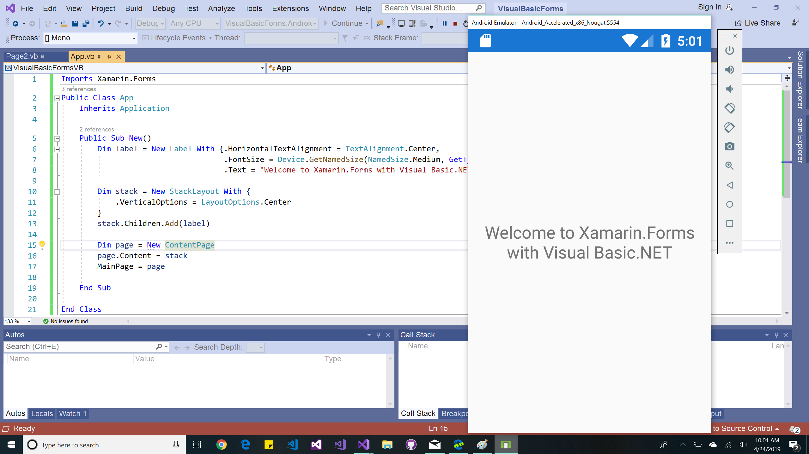

# Xamarin.Forms with Visual Basic

Sample for the [Xamarin.Forms using Visual Basic.NET](https://docs.microsoft.com/xamarin/cross-platform/platform/visual-basic/xamarin-forms) page on the [Xamarin Developer Portal](https://docs.microsoft.com/xamarin).

> [!IMPORTANT]
> This sample *requires* Visual Studio and the Mobile Development with .NET (Xamarin) workload installed.
>
> _^ if you *really* wanted to try it in Visual Studio 2019 for Mac, note that the Visual Basic project will not have syntax-highlighting, code-completion, or IntelliSense._

## Notes

See this information about [Visual Basic and .NET Standard](https://docs.microsoft.com/xamarin/cross-platform/platform/visual-basic/)
and using Visual Basic to build a Xamarin.Forms app using Visual Basic.

All the common code, including business logic *and* the user interface, is written in Visual Basic.NET.
The platform projects (for iOS and Android) must still be C# projects (since Xamarin does not support Visual Basic),
and if you want to use XAML, you need to put the XAML pages in a C# project too. But all your code
can be Visual Basic.NET (well, except Custom Renderers and the Dependency Service, which need to be C# if they're required at all).

If you are browsing the VB code, this
[Visual Basic Reference](https://docs.microsoft.com/dotnet/visual-basic/language-reference/) might come in handy ;)
